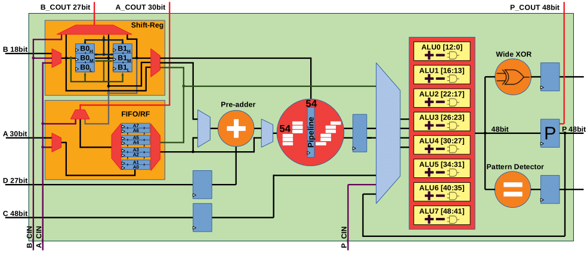

# PIR-DSP: An FPGA DSP Block Architecture for Multi-precision Deep Neural Networks

This repository is related to PIR-DSP idea.
@ FCCM 2019, San Diego, USA

The materials for this paper are waiting for The University of Sydney disclosure committee approval.

The paper link:
https://ieeexplore.ieee.org/document/8735533

    @inproceedings{DBLP:conf/fccm/RasoulinezhadZW19,
      author    = {SeyedRamin Rasoulinezhad and
                   Hao Zhou and
                   Lingli Wang and
                   Philip H. W. Leong},
      title     = {{PIR-DSP:} An {FPGA} {DSP} Block Architecture for Multi-precision
                   Deep Neural Networks},
      booktitle = {27th {IEEE} Annual International Symposium on Field-Programmable Custom
                   Computing Machines, {FCCM} 2019, San Diego, CA, USA, April 28 - May
                   1, 2019},
      pages     = {35--44},
      year      = {2019},
      crossref  = {DBLP:conf/fccm/2019},
      url       = {https://doi.org/10.1109/FCCM.2019.00015},
      doi       = {10.1109/FCCM.2019.00015},
      timestamp = {Tue, 18 Jun 2019 13:09:58 +0200},
      biburl    = {https://dblp.org/rec/bib/conf/fccm/RasoulinezhadZW19},
      bibsource = {dblp computer science bibliography, https://dblp.org}
    }

